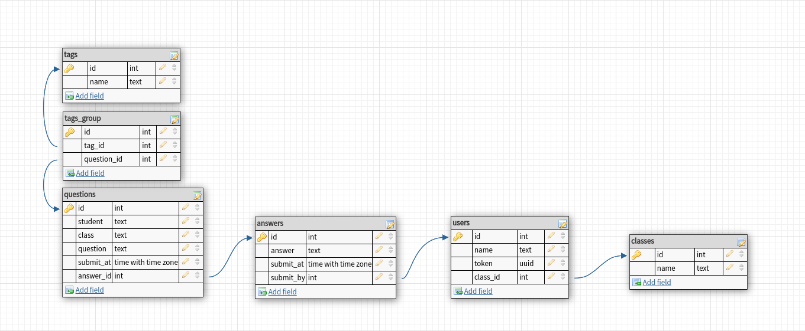

# soverflow
<p align="center" >
    
</p>

    

<p align="center" >
  Soverflow é uma aplicação backend que gerencia e manipula os dados de um sistema de perguntas e respostas. Onde qualquer um pode mandar uma pergunta,
  sem necessidade de cadastro prévio. Cada pergunta é categorizada em um sistema de tags, e pode ser respondida por outros usuários. Para garantir a
  a confiabilidade, todos os respondentes precisam se cadastrar na plataforma através dos endpoints apropriados.
</p>

## Tecnologias ultilizadas:


## Arquitetura do banco:

<p align="center" >
    
</p>


## Documentação:

- **POST `/questions`**
    
    Adiciona uma nova pergunta, não é necessário nenhum tipo de autenticação para enviar perguntas.
    
    ```json
    {
    	"question": "Uki ta contecendo?",
    	"student": "Zoru",
    	"class": "T3",
    	"tags": "typescript, vida, javascript, java?"
    }
    ```
    
    O retorno é um id da pergunta cadastrada
    
    ```json
    {
    	"id": 123456
    }
    ```
   
- **GET `/questions/:id`**

    Existem duas respostas possíveis, pergunta não respondida:

  ```json
  {
    "question": "Uki ta contecendo?",
    "student": "Zoru",
    "class": "T3",
    "tags": "typescript, vida, javascript, java?"
    "answered": false,
    "submitAt": "2021-01-01 10:12"
  }
  ```

    E pergunta respondida:

  ```json
  {	
    "question": "Uki ta contecendo?",
    "student": "Zoru",
    "class": "T3",
    "tags": "typescript, vida, javascript, java?"
    "answered": true,
    "submitAt": "2021-01-01 10:12"
    "answeredAt": "2021-01-01 10:30"
    "answeredBy": "Vegeta",
    "answer": "É mais de 8 miiiil!" 
  }
  ```

- **POST `/questions/:id`** 

  Essa rota é usada para responder perguntas com base no id da pergunta, ela captura um **Bearer token** que será usado para identificar quem respondeu a pergunta. Logo, só é possível responder perguntas quem foi devidamente cadastrado no sistema a partir da rota `POST /users`

  ```json
  {
    "answer": "É mais de 8 miiiil!" 
  }
  ```
  
- **GET `/questions`**

    Essa rota retorna apenas as perguntas não respondidas

  ```json
  [
    {
      "id": 123243,
      "question": "Uki ta contecendo?", 
      "student": "Zoru", 
      "class": "T3",
      "submitAt": "2021-01-01 10:12"
    }
  ]
  ```
  
- **POST `/users`**

  Essa rota é usada para cadastrar uma pessoa e retorna um token que será usado para responder perguntas. O nome de usuário `name` deve ser único.

  ```json
  {
    "name": "Vegeta",
    "class": "T3" 
  }
  ```

  ```json
  {
    "token": "1234-5678"
  }
  ```
